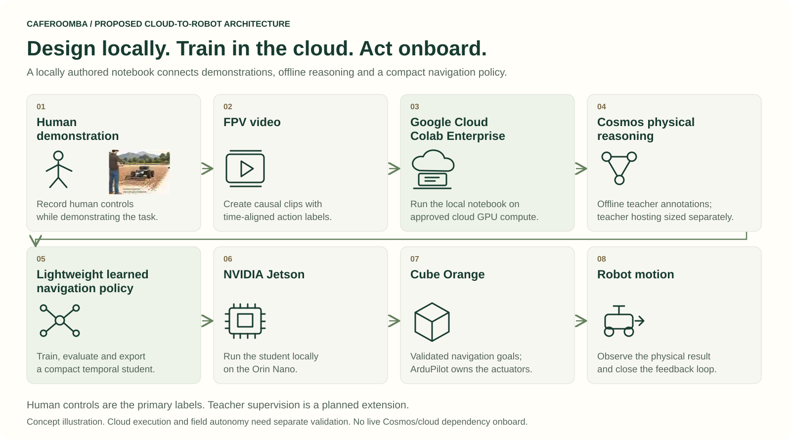

# Architecture

## The boundary that matters

The **Jetson reasons and proposes navigation objectives**. The **Cube/ArduPilot owns actuator outputs**. The cloud is a development and artifact-management resource, not an online dependency for steering.

```text
OFFLINE / workstation or approved cloud job
FPV video + synchronized human commands
  → causal clips + run-level splits
  → [planned] reviewed Cosmos annotations
  → lightweight temporal student → evaluation → ONNX

ONBOARD / target Jetson
RGB camera history → local student → typed intent
  → telemetry + geofence + clearance + freshness validation
  → single vehicle interface → Cube/ArduPilot → actuators

IMPLEMENTED PUBLIC EXECUTION
student / fixture → supervisor → dry-run log (no motion)
```

## Module ownership

| Area | Public code | Local integration direction |
|---|---|---|
| Application | `app/config.py`, `app/fsm.py`, `app/loop.py` | Composition and lifecycle in `app/bootstrap.py`; deterministic FSM |
| Perception | `perception/camera.py`, `realsense.py`, `buffer.py` | Timestamp/modality contract, bounded acquisition worker, shared preprocessing |
| Learning | `data/`, `learning/`, `teacher/` | Offline only; no imports into the control-critical path |
| Deployment | `deployment/export_onnx.py`, `deployment/inference.py` | Validated model inputs/outputs, artifact hashes, target parity |
| Geographic constraints | `geofence/fence.py` placeholder | KML/KMZ parser, metric projection, exclusions and path checks |
| Vehicle | `vehicle/client.py`, `vehicle/dry_run.py` | Single serial owner; passive/MAVSDK telemetry; commands remain disabled |
| Control | `control/intents.py`, `safety.py`, `turn180.py` | Dispatch-time freshness, explicit maneuver completion, watchdog before actuation |
| Recording | Not connected in public baseline | Local bounded recording queue; no automatic upload |

Local additions are not part of the published baseline until separately reviewed and merged. Existing legacy `rover/` code remains historical and is not an actuator fallback.

## Contracts

Constructors do not open devices. `open()` / `connect()` acquire resources, `read()` / `telemetry()` return bounded observations, and `close()` releases them. Use typed records and dependency injection so cameras, clocks, vehicles, and policies can be substituted in tests.

A frame contract distinguishes RGB from infrared, native capture time from host receipt time, and metric/raw depth from a preview. A telemetry contract separates operator commands from measured motion and marks stale or missing values rather than replacing them with zero.

An intent carries action, linear speed in metres/second, yaw rate in radians/second, coordinate frame, issue time, expiry, validity and source. Internal body yaw is left-positive; adapter conversions are explicit and tested. Geographic `(longitude, latitude)` must never be confused with a local metric `(x, y)`.

## Outstanding integration issues

The public live-teacher function deliberately refuses execution, and teacher annotations are not consumed by the current trainer. The smoke trainer reuses a small initial batch; its fallback from an empty training split must not be used for scientific evaluation. The public turn class is not a verified next-pass planner. See [Roadmap](PENDING_WORK.md) and [Model card](MODEL_CARD.md).

## Design references

[ArduPilot Rover GUIDED commands](https://ardupilot.org/dev/docs/mavlink-rover-commands.html), [KML coordinate specification](https://developers.google.com/kml/documentation/kmlreference), [pyproj Transformer](https://pyproj4.github.io/pyproj/stable/api/transformer.html). Verify message and native-library compatibility on the installed firmware/software versions before enabling a hardware adapter.

## Cloud-to-robot experiment

Human demonstration → FPV video → **Google Cloud Colab Enterprise** → Cosmos physical reasoning → lightweight learned navigation policy → NVIDIA Jetson → Cube Orange → robot motion.

Colab is the proposed notebook/compute environment; teacher hosting is sized independently and is not part of real-time steering. [Read the experiment](EXPERIMENT.md).


