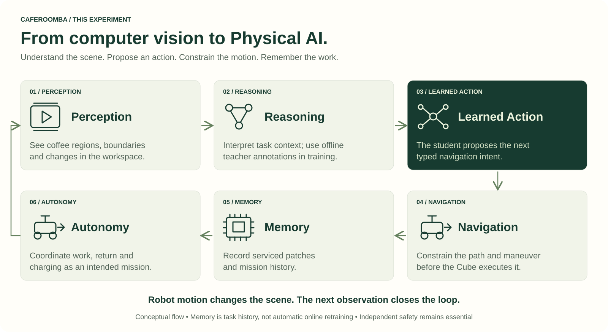

# This Experiment: local notebooks, cloud training, physical action

## Goal

CafeRoomba explores the transition from computer vision to Physical AI: a robot should not merely recognize coffee on a drying patio; it should learn useful navigation proposals from human demonstrations and execute only what the independent navigation and safety layers permit.

The immediate learning targets are small left/right corrections, continuing a sweeping pass, stopping, and identifying the onset of a 180-degree reversal. The intended complete mission adds verified next-pass placement, spatial task memory, safe return-home and confirmed charging. These are goals with separate implementation and validation gates, not performance claims.

## Architecture

**Human demonstration → FPV video → Google Cloud Colab Enterprise → Cosmos physical reasoning → lightweight learned navigation policy → NVIDIA Jetson → Cube Orange → robot motion**

This is a workflow diagram, not a claim that all components run in a single process. Colab Enterprise hosts the notebook and approved compute. Cosmos is an offline teacher, hosted on an appropriately sized backend. Human controls are the primary action labels. Reviewed teacher annotations are intended as auxiliary supervision; the current trainer does not yet consume those annotations.

The student alone is intended for onboard inference. Its image history and supported onboard state must be sufficient at runtime; live Cosmos features, cloud credentials and future video frames must not be required for steering.

## Why Colab Enterprise matters when local GPUs are limited

The project can design experiments on the equipment already available instead of first buying a large training server. A notebook developed and reviewed locally can be imported into Colab Enterprise and connected to managed compute with the GPU, memory, storage and network configuration needed for that experiment.

This separates **where code is authored** from **where the heavy computation executes**. Local CPU/limited-GPU checks are useful for schemas, preprocessing, tests and tiny fixtures. Approved cloud GPU capacity is the proposed route for larger student-training runs, video processing and separately provisioned teacher workloads.

This is not free or unlimited compute. GPU availability depends on region, machine type and quota. Runtime compute and storage are billable. Idle shutdown helps manage compute usage but is not a hard budget cap; persistent disks can continue to incur charges. Do not claim a cost saving or speedup until measured against a defined local baseline.

An L4/T4-sized student experiment does not establish that a full Cosmos model fits in that GPU's memory. Check the exact teacher model, backend and supported precision independently. Calling a hosted teacher from a notebook is different from hosting or fine-tuning that teacher on the notebook runtime.

## The local-notebook-to-cloud workflow

| Step | Local work | Approved cloud work |
|---|---|---|
| Design | Version notebooks and repository modules; test data contracts in isolated environments | Import the same reviewed IPYNB and pin the repository commit |
| Prepare | Inspect footage, verify viewpoints, align camera/controls and split by run | Read approved private objects from GCS; prepare a versioned manifest |
| Annotate | Test mock schemas without calling services | Call a verified Cosmos backend; review annotations and preserve provenance |
| Train | Run tiny synthetic smoke tests | Train the compact policy over the actual training split, using a suitable GPU |
| Evaluate | Define acceptance criteria and export parity tests | Evaluate on held-out runs; record dataset hashes, hardware, versions and metrics |
| Export | Validate artifact interfaces locally | Save versioned model/checkpoints and reports to approved storage |
| Deploy | Benchmark the student on the actual Jetson | No cloud connection in the robot's real-time command path |

The existing locally designed entry notebooks are [prepare and annotate](../notebooks/01_prepare_and_annotate.ipynb), [train and evaluate](../notebooks/02_train_and_evaluate.ipynb), and [export and replay](../notebooks/03_export_and_replay.ipynb). They currently exercise synthetic CPU examples. Importing them into Colab does not by itself convert them to a real-data or GPU trainer; device selection, full-dataset iteration, teacher integration and evidence capture must be implemented and verified.

Choose the cloud Python/runtime deliberately; the robot runtime uses Python 3.11 but a new default Colab runtime need not use the same version. Keep an environment record and compatible artifact boundary. Save outputs outside ephemeral runtime disks before shutting down/deleting resources.

## From computer vision to Physical AI

**Perception → Reasoning → Learned Action → Navigation → Memory → Autonomy**

Perception supplies observations. Offline reasoning contributes reviewed training context. The learned student proposes actions. Navigation and safety constrain those proposals. Memory records serviced patches and task history. The mission state machine coordinates the intended autonomous work cycle. The robot's physical action produces the next observation.

Memory here means persistent task state, not automatic online neural-network weight updates. Autonomous operation still requires independent checks for timing, sensor health, geofence, vehicle state and maneuver clearance.

## What the public videos do and do not establish

Two compact previews are derived from owner-designated raw-data folders. One is filed under FPV, but visibly shows the rover from behind: that is not sufficient evidence of an onboard camera. The external-view sample is for task context, not an FPV policy input. Acquisition/generation provenance, operator labels, clock synchronization and the software that produced any motion are not verified by these previews. See [Media provenance](MEDIA.md).

## Evidence boundary

The website is an explanation of the experiment. It does not run training, invoke Cosmos, open the private bucket, or operate the robot. Published code and prior CPU tests are evidence of the software baseline. A verified Colab Enterprise run, real teacher output, a held-out evaluation and target-device measurements remain separate evidence requirements. See [Status](STATUS.md) and [Model card](MODEL_CARD.md).

## Primary platform references

- [Google Cloud: Introduction to Colab Enterprise](https://docs.cloud.google.com/colab/docs/introduction)
- [Google Cloud: Runtimes and runtime templates](https://docs.cloud.google.com/colab/docs/runtimes)
- [Google Cloud: Colab Enterprise pricing](https://cloud.google.com/colab/pricing)

Platform references checked 2026-09-12 UTC. These describe service capabilities, not completed CafeRoomba cloud experiments.
